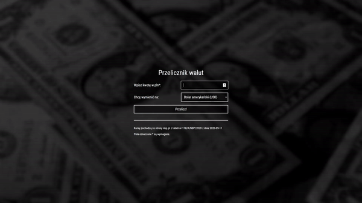

# Currency converter

## About the project

The page is written according to the BEM convention

### How to proceed

1. Enter your amount in PLN to the first field
2. Chose between 3 currencies (USD, GBP, EUR)
3. Click on the _"Przelicz!"_ button to convert PLN to chosen currency

## Demo

https://msmajdor.github.io/currency-converter/
